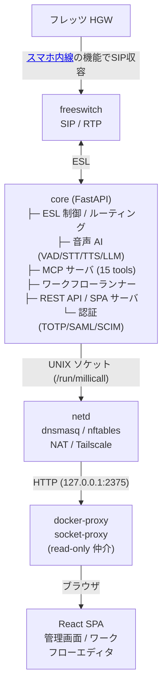

# millicall

[](https://github.com/mizphses/millicall/actions/workflows/ci.yml)
[](https://github.com/mizphses/millicall/actions/workflows/release-stable.yml)
[](https://github.com/mizphses/millicall/actions/workflows/release-dev.yml)

## 概要

フレッツ光回線の HGW（ホームゲートウェイ）に対応したローカル PBX システム。

コアは FastAPI（ESL 制御・音声 AI・MCP サーバ）と FreeSWITCH（SIP/RTP 処理）で構成され、React SPAが管理 UI を担う。本番スタックは役割別 4 コンテナ（`core` / `freeswitch` / `netd` / `docker-proxy`）で動作し、GHCR のプリビルドイメージ（amd64）を `install.sh` ワンライナーで導入できる。

## 主な機能

- **内線・外線・ルーティング**: SIP 内線管理、外線トランク（SIP trunk）設定、着信ルーティング、CDR（通話明細）、電話帳、オンデマンド発信
- **音声 AI パイプライン**: WebRTC VAD + ストリーミング STT（Google Speech-to-Text）+ 文分割 TTS（VoiceVox または OpenJTalk）+ バージイン（再生中の割り込み検知）。LLM は Anthropic / OpenAI / Gemini / Vertex AI に対応。TTS は VoiceVox / OpenJTalk 対応。STT は Google Cloud Speech-to-Text / Whisper 対応。プロバイダカタログは管理画面から切り替え可能
- **MCPエージェント**: MCP over HTTP サーバ（`converse` を含む 15 ツール）を標準搭載。`dial` / `say` / `listen` / `hangup` 等の電話プリミティブと、`converse`（自律会話）、電話帳 CRUD、内線・トランク一覧など。OAuth2.1 による認証済み外部エージェント連携対応
- **ワークフロー（IVR + AI ノード）**: xyflow ベースのビジュアルエディタで IVR フロー・AI 分岐ノードを構築。React SPA から設定・プレビューが可能
- **ゼロタッチプロビジョニング + netd**: SIP 電話機向け自動設定配布（ZTP）。`netd` コンテナが dnsmasq（DHCP/DNS）・nftables NAT・Tailscale を管理し、フレッツ環境の NW 設定をコアから API 経由で制御
- **認証強化**: TOTP 2FA、SAML SP（シングルサインオン）、SCIM プロビジョニング、操作監査ログ、レート制限、CSRF 保護、内線ごとの発信権限制御、SIP 多層防御、Docker socket-proxy（`docker.sock` は proxy コンテナのみに read-only マウント）
- **ワンライナー導入 + GHCR プリビルドイメージ**: `install.sh` が compose・`.env` 生成・イメージ pull・起動を一括実施。イメージは GHCR（amd64）で公開。更新は `millicallctl update` 一発

## クイックデプロイ

**前提条件**: Docker Engine + Compose v2、amd64 Linux、フレッツ HGW 環境

```bash
curl -fsSL https://raw.githubusercontent.com/mizphses/millicall/main/install.sh | bash
```

インストーラが `~/millicall/` に `docker-compose.yml` と `.env` を配置し、GHCR からプリビルドイメージを pull して起動する。対話項目: サーバ LAN IP・リリース版（`latest` 推奨）・`cookie_secure`。

**初期管理者パスワード**（初回起動ログに一度だけ表示）:

```bash
millicallctl logs core | grep 初期管理者
```

**更新**:

```bash
millicallctl update
```

詳細は [docs/ops/deployment.md](docs/ops/deployment.md) を参照。

### イメージ

| イメージ | 用途 |
|---|---|
| `ghcr.io/mizphses/millicall-core` | FastAPI コア（ESL / AI / MCP）|
| `ghcr.io/mizphses/millicall-freeswitch` | FreeSWITCH（mod_audio_stream 同梱）|
| `ghcr.io/mizphses/millicall-netd` | ネットワーク管理デーモン |
| `ghcr.io/tecnativa/docker-socket-proxy` | Docker API 最小公開プロキシ |

タグ: `latest`（stable 最新）/ `vX.Y.Z`（固定）/ `dev` / `main-<sha>`（プレビュー）。

> **arm64 について:** FreeSWITCH ベースイメージ（`safarov/freeswitch`）が amd64 専用のため、現時点のスタック全体が amd64 に固定。arm64 対応は将来課題。

## ドキュメント

`/docs` 以下のドキュメントは [GitHub Wiki](https://github.com/mizphses/millicall/wiki) にも同期される。

### 主要ドキュメントのご紹介

| ドキュメント | 内容 |
|---|---|
| [docs/quickstart.md](docs/quickstart.md) | 5 分でわかるセットアップ手順 |
| [docs/index.md](docs/index.md) | 総合目次 |
| [docs/ops/deployment.md](docs/ops/deployment.md) | デプロイ・更新・ロールバック・バックアップ |
| [docs/sso.md](docs/sso.md) | SAML SP / SCIM 設定 |
| [docs/workflows.md](docs/workflows.md) | ワークフロー（IVR + AI ノード）の使い方 |
| [docs/mcp.md](docs/mcp.md) | MCP エージェント API リファレンス |
| [docs/security-model.md](docs/security-model.md) | セキュリティモデル（認証・防御・権限設計）|
| [docs/troubleshooting.md](docs/troubleshooting.md) | よくあるトラブルと解決策 |

## アーキテクチャ

全コンテナは `network_mode: host`（docker-proxy を除く）。`core` と `netd` は名前付き volume（`millicall-run`）で UNIX ソケットを共有する。



## 開発
以下のコマンド・ツールを使用している（察してください）

### バックエンド（Python / uv）

```bash
uv sync --extra dev
uv run pytest -q
uv run ruff check .
```

### フロントエンド（React / Vite）

```bash
cd frontend
pnpm install
pnpm run build    # 本番ビルド
pnpm run test     # vitest
```

### ローカル起動（スタック全体）

```bash
docker compose up -d --build
```
